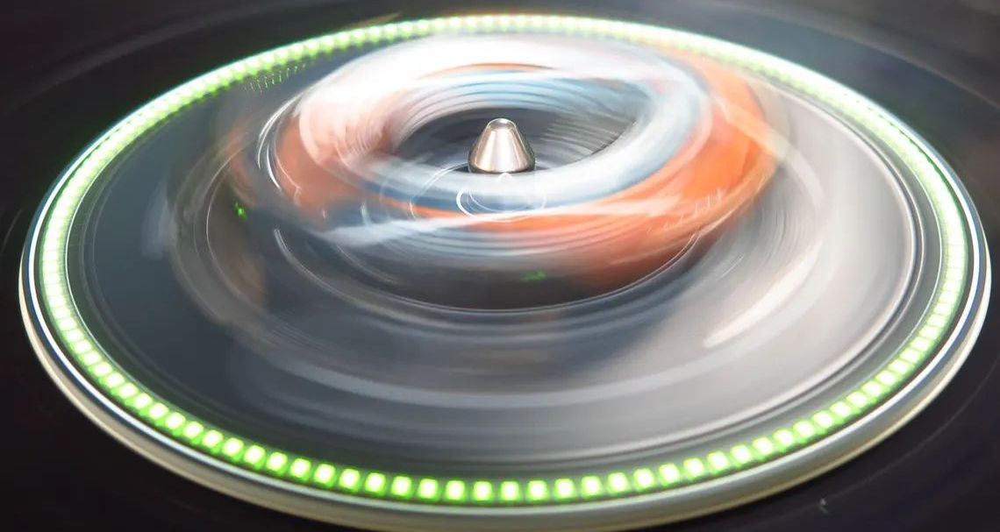
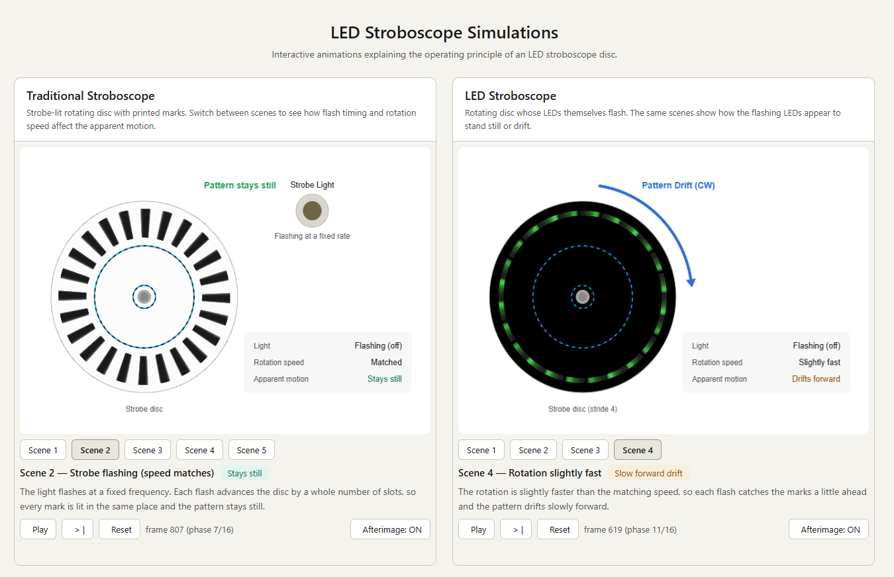

# LED Stroboscope Simulation

Interactive web animations that explain the operating principle of an LED stroboscope disc, alongside a traditional strobe-lit disc for comparison.



## 🔗 Live simulation

**https://elehobica.github.io/led_stroboscope_simulation/**

[](https://elehobica.github.io/led_stroboscope_simulation/)

The landing page shows both simulations side by side:

- **Traditional Stroboscope** — a rotating disc with printed marks, lit by an external flashing strobe lamp.
- **LED Stroboscope** — a rotating disc whose LEDs themselves flash; no external lamp is needed.

Switch between scenes to see how flash timing versus rotation speed makes the pattern appear to stand still, drift backward, or drift forward.

## Scenes

Both simulations share the same core scenes:

| Scene | What it shows |
|---|---|
| 1 — Continuous light | The light stays on; the marks blur and rotation is clearly visible. |
| 2 — Strobe flashing (speed matches) | Each flash advances the disc by a whole number of slots, so the pattern stands still. |
| 3 — Rotation slightly slow | Each flash catches the marks a little behind; the pattern drifts slowly backward. |
| 4 — Rotation slightly fast | Each flash catches the marks a little ahead; the pattern drifts slowly forward. |
| 5 — Printed pattern (stride 4) *(Traditional only)* | A sparse printed disc lit by the same strobe, showing the printed-pattern case. |

Controls in each simulation: **Play / Pause**, **Reset**, scene buttons, and an **Afterimage** toggle.

## Stride (mark spacing)

*Stride* is how many slots apart the marks are placed around the disc.

### Traditional: basically stride = 1

The traditional disc is designed for **stride = 1** (Scenes 1–4): a mark in every slot.
**Scene 5** demonstrates **stride = 4**. It still works in principle, but because the
strobe lamp also lights the blank (white) areas between marks, the pattern looks washed out
and faint. A printed disc therefore wants a dense pattern.

### LED: stride = 4

The LED simulation uses **stride = 4** for all scenes (real discs use roughly **stride = 3–4**).
Since the LEDs light up against a **dark background**, widening the stride does not significantly
hurt the visibility of the pattern — only the lit LEDs are bright, so the gaps stay dark instead
of being washed out.

Why give the LEDs a stride at all:

- **Fewer LEDs** — spacing the marks out reduces the number of LEDs required.
- **Concentric layout without physical interference** — the gaps left by the stride make room to
  place the 33⅓ rpm and 45 rpm LED rings concentrically without them physically colliding.

## How it works

- The program is consolidated in **`strobe_core.js`**, shared by both pages.
- The only difference between the traditional and LED versions is each page's `window.STROBE_CONFIG`
  (colors, compositing mode, pattern shape, scene definitions, and whether an external strobe lamp is drawn).
- Scene buttons are generated dynamically by `strobe_core.js` from the `scenes` array — there is no static list in the HTML.
- The afterimage effect uses an accumulation buffer (offscreen canvas), assigning a compositing mode
  (`source-over` / `lighter`) and color to the lit and unlit regions.
- `strobe_core.js` is loaded as a **classic script** (not `type="module"`), so the pages work both when
  opened directly from `file://` and when served over HTTPS via GitHub Pages.

## Files

| File | Role |
|---|---|
| `index.html` | Landing page; embeds both simulations in side-by-side `<iframe>`s. |
| `trad_stroboscope_simulation.html` | Traditional (printed-pattern) simulation. |
| `led_stroboscope_simulation.html` | LED-type simulation. |
| `strobe_core.js` | Shared program body for both pages. |

## Running locally

No build step is required. Either:

- Open `index.html` directly in a browser (`file://`), or
- Serve the folder over HTTP, e.g.:

  ```sh
  python -m http.server
  ```

  then open `http://localhost:8000/`.
